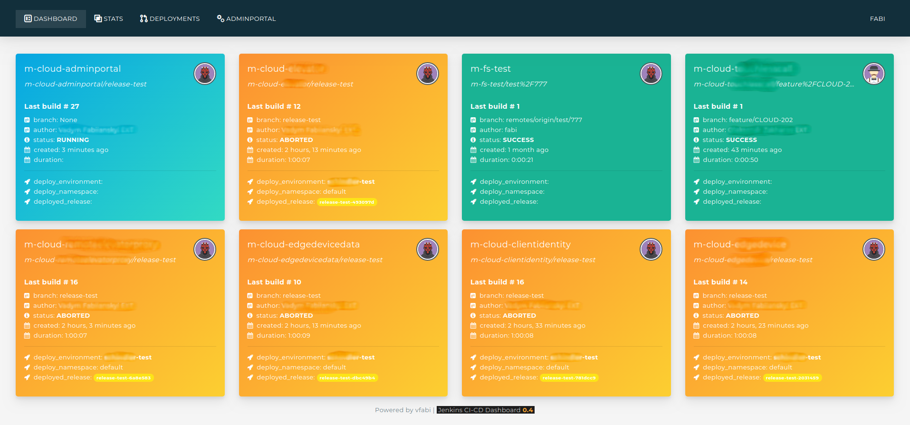
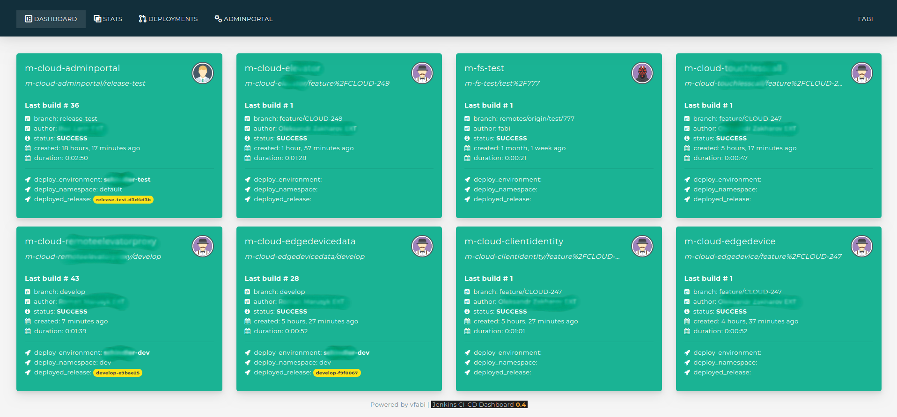
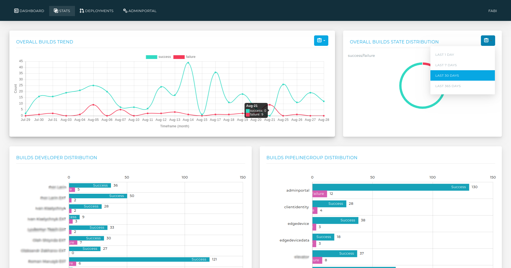
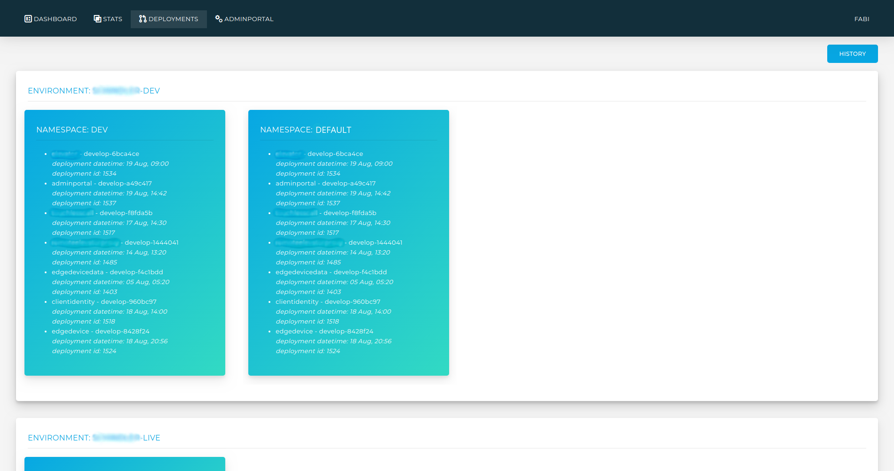
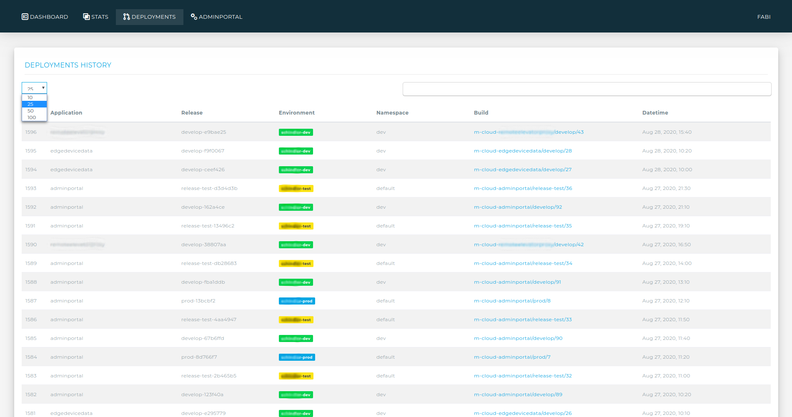
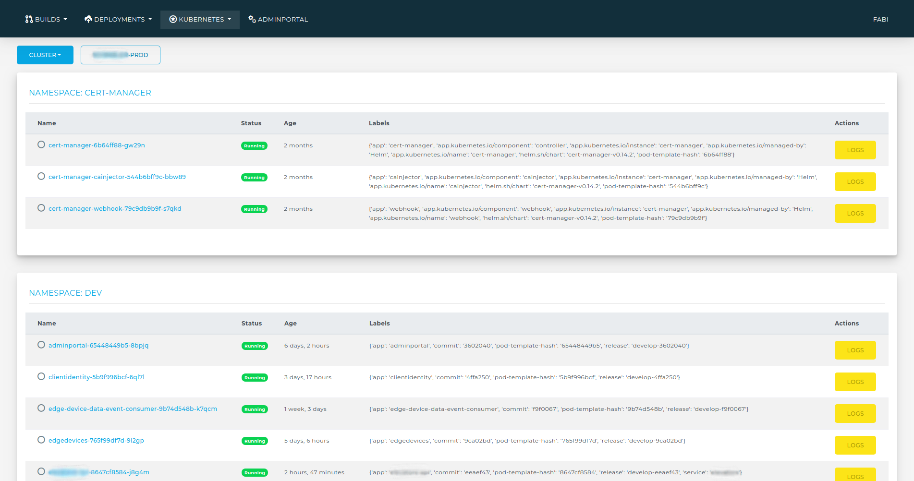
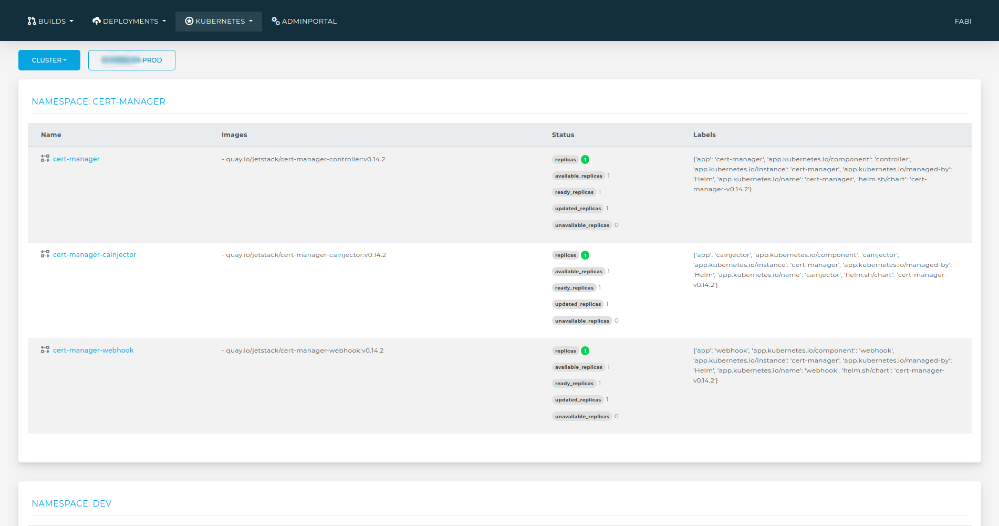

# Jenkins CI-CD dashboard

Jenkins CI-CD dashboard web application.  
Modules:
* Builds - Jenkins builds dashboard, Jenkins builds stats/charts
* Deployments - deployments dashboard and history based on data from Jenkins builds
* Kubernetes - online Kubernetes clusters data. Deployments, pods list and statuses, pod logs. 

Sourcecode is not public yet. Used in several commercial environments.

## Screens
Builds module - Jenkins builds dashboard

Builds module - Jenkins builds dashboard

Builds module - Jenkins builds stats/charts

Deployments module - dashboard (application releases distribution across environments and Kubernetes namespaces)

Deployments module - history

Kubernetes module - pods

Kubernetes module - deployments

